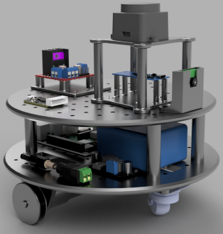
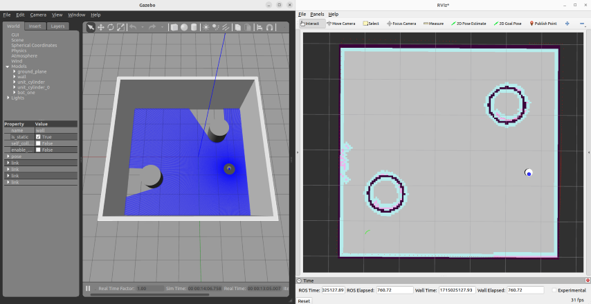

# MOGBE

[](https://opensource.org/licenses/BSD-3-Clause)
[](https://mogbe.readthedocs.io/pt/latest/?badge=latest)

**MOGBE** - **Mo**bile **G**round Ro**b**ot for **E**ducation: um robô autônomo para aprendizagem de robótica móvel com ROS no ensino superior

Confira a [documentação oficial do MOGBE](https://mogbe.readthedocs.io).

> O MOGBE é fruto de um Trabalho de Conclusão de Curso (TCC) desenvolvido por alunos do curso de Engenharia de Controle e Automação da Faculdade Engenheiro Salvador Arena (FESA).
> A plataforma foi desenvolvida com o intuito de ser integrada às aulas de Robótica e Tópicos Especiais de Engenharia para promover um melhor entendimento de conceitos teóricos de robótica móvel com implementações práticas em ambiente simulado e real.
> Apesar de sua proposta primária de ser integrada às aulas da FESA, o código-fonte da plataforma está disponível ao público geral pois ela foi desenvolvida a fim de permitir que entusiastas com conhecimentos em eletrônica e programação possam utilizá-la para aprofundar seus conhecimentos em robótica móvel ou até construírem sua própria solução.

<p float="left">
  
   
</p>

## Conteúdos

- [Direcionamento](#direcionamento)
- [Configuração da área de trabalho](#criando-uma-área-de-trabalho-para-o-mogbe)
- [Execução de simulação](#exemplo-de-simulação-do-mogbe)
- [Execução do robô físico](#exemplo-do-robô-físico-mogbe)
- [Comandos adicionais](#comandos-adicionais)

## Direcionamento

O MOGBE utiliza um computador portátil Raspberry Pi 3B+ em conjunto com Arduino Nano para controle da plataforma física. Um computador externo (dev machine) é utilizado para executar operações complexas de SLAM, navegação autônoma e simulações. Preparei uma trilha para seguir e facilitar a configuração de acordo com sua necessidade. Siga o passos na [documentação oficial do MOGBE](https://mogbe.readthedocs.io/).

1. Você só vai rodar simulações e possui a máquina virtual pré-configurada para aulas de Robótica com a imagem `Ubuntu 22.04.4 ROS2`:
    - [Execução de simulação](https://mogbe.readthedocs.io/pt/latest/rodando_exemplo/rodando_simulacao.html)

2. Você só vai rodar simulações e não possui uma máquina configurada com Ubuntu 22.04 e ROS 2:
    - [Configuração de OS: Dev Machine](https://mogbe.readthedocs.io/pt/latest/configuracao_inicial/configuracao_dev_machine.html)
    - [Configuração da área de trabalho](https://mogbe.readthedocs.io/pt/latest/area_de_trabalho/index.html)
    - [Execução de simulação](https://mogbe.readthedocs.io/pt/latest/rodando_exemplo/rodando_simulacao.html)

3. Você vai rodar o robô real e simulações, possui a máquina virtual pré-configurada para aulas de Robótica com a imagem `Ubuntu 22.04.4 ROS2` mas precisa configurar o robô real:
    - [Configuração de OS: Raspberry Pi](https://mogbe.readthedocs.io/pt/latest/configuracao_inicial/configuracao_rasp_pi.html)
    - [Flashing de firmware: Arduino Nano](https://mogbe.readthedocs.io/pt/latest/configuracao_inicial/flashing_arduino.html)
    - [Configuração da área de trabalho](https://mogbe.readthedocs.io/pt/latest/area_de_trabalho/index.html)
    - [Execução de simulação](https://mogbe.readthedocs.io/pt/latest/rodando_exemplo/rodando_simulacao.html)
    - [Execução do robô físico](https://mogbe.readthedocs.io/pt/latest/rodando_exemplo/rodando_robo_fisico.html)

4. Você vai rodar o robô real e simulações, não possui uma máquina com ambiente Ubuntu 22.04 e ROS 2:
    - [Configuração de OS: Dev Machine](https://mogbe.readthedocs.io/pt/latest/configuracao_inicial/configuracao_dev_machine.html)
    - [Configuração de OS: Raspberry Pi](https://mogbe.readthedocs.io/pt/latest/configuracao_inicial/configuracao_rasp_pi.html)
    - [Flashing de firmware: Arduino Nano](https://mogbe.readthedocs.io/pt/latest/configuracao_inicial/flashing_arduino.html)
    - [Configuração da área de trabalho](https://mogbe.readthedocs.io/pt/latest/area_de_trabalho/index.html)
    - [Execução de simulação](https://mogbe.readthedocs.io/pt/latest/rodando_exemplo/rodando_simulacao.html)
    - [Execução do robô físico](https://mogbe.readthedocs.io/pt/latest/rodando_exemplo/rodando_robo_fisico.html)

## Criando uma área de trabalho para o MOGBE

- Crie a área de trabalho ROS:

```bash
mkdir -p ~/mogbe_ws/src && cd ~/mogbe_ws/
```

- Clone os repositórios:

```bash
git clone https://github.com/gsarenas/mogbe.git src/mogbe && \
git clone https://github.com/gsarenas/serial.git src/serial && \
git clone https://github.com/gsarenas/diffdrive_arduino.git src/diffdrive_arduino && \
git clone https://github.com/gsarenas/ldlidar_stl_ros2.git src/ldlidar_stl_ros2
```

- Para instalar as dependências, inicialize rosdep se ainda não tiver feito:

```bash
sudo rosdep init
```

- Instale as dependências:

```bash
rosdep update && rosdep install --from-paths src --ignore-src -r -y
```

- Compile o projeto:
```bash
colcon build --symlink-install
```

## Exemplo de simulação do MOGBE

- Simulações são executadas na dev machine e independem do Raspberry Pi. Para executar um exemplo, garanta que esteja na pasta `mogbe_ws` e que as variáveis de ambiente estejam configuradas:

```bash
cd ~/mogbe_ws && source install/setup.bash
```

- Execute a simulação de teste no ambiente `wall.world`:

```bash
ros2 launch mogbe mogbe_simulation_all.launch.py world:=./src/mogbe/worlds/wall.world
```

- O ambiente de simulação Gazebo, a ferramenta de visualização RViz e demais `nós` devem inicializar. Lembre-se que o Gazebo é o simulador 3D, enquanto o RViz como o robô "enxerga" o mundo com as informações limitadas que tem.



- Para controle manual do robô na simulação, abra um novo terminal e rode o `nó` de comando `teleop_twist_keyboard`:

```bash
ros2 run teleop_twist_keyboard teleop_twist_keyboard --ros-args --remap /cmd_vel:=/cmd_vel_joy
```

> [!TIP]
> É necessário que o terminal com o `teleop_twist_keyboard` esteja em foco para controlar o robô manualmente.

## Exemplo do robô físico MOGBE

### Raspberry Pi

- Garanta que esteja na pasta `mogbe_ws` e que as variáveis de ambiente estejam configuradas:

```bash
cd ~/mogbe_ws && source install/setup.bash
```

- Inicie o robô e sensor lidar:

```bash
ros2 launch mogbe mogbe_robot_pi_all.launch.py
```

### Dev Machine

- Após ter inicializado o MOGBE no Raspberry Pi, abra um novo terminal, garanta que esteja na pasta de trabalho `mogbe_ws` e que as variáveis de ambiente estejam configuradas:

```bash
cd ~/mogbe_ws && source install/setup.bash
```

- Execute os `nós` de SLAM, navegação autônoma e visualização:

```bash
ros2 launch mogbe mogbe_robot_dev.launch.py
```

- Para controle manual do MOGBE, é necessário abrir uma nova aba de terminal e executar o `nó` de comando `teleop`:

```bash
ros2 run teleop_twist_keyboard teleop_twist_keyboard --ros-args --remap /cmd_vel:=/cmd_vel_joy
```

> [!TIP]
> É necessário que o terminal com o `teleop_twist_keyboard` esteja em foco para controlar o robô manualmente.

## Comandos adicionais

Aqui temos uma "cola rápida" dos comandos que estão por trás do arquivos `.launch.py` caso necessite inicializar os processos de maneira separada. Há também alguns comandos adicionais de ferramentas e recursos (ROS e terceiros) que permitem melhor entendimento e/ou visualização do funcionamento do MOGBE. Caso queira explorá-los, reserve um tempo para estudá-los com calma, pois alguns possuem sequência e dependem de outros processos para funcionarem.

> [!TIP]
> Entenda valores entre `<` `>` como o tipo de dado esperado para os parâmetros. Exemplo: `use_sim_time:=<bool>` &#8594; `use_sim_time:=true` | `use_sim_time:=false`.

| Descrição | Ambiente | Comando|
| :-------: | :------: | :----: | 
| Robô (real) | Pi | `ros2 launch mogbe mogbe_robot_pi.launch.py` |
| LiDAR | Pi | `ros2 launch ldlidar_stl_ros2 ld19.launch.py` |
| Robô (sim) + controlador + mundo + posição | Dev | `ros2 launch mogbe mogbe_simulation.launch.py use_ros2_control:=<bool> world:=./src/mogbe/worlds/<world_name.world> x:=<float> y:=<float> z:=<float>` |
| teleop_twist_keyboard | Dev/Pi | `ros2 run teleop_twist_keyboard teleop_twist_keyboard --ros-args --remap /cmd_vel:=/cmd_vel_joy` |
| twist_mux | Dev/Pi | `ros2 run twist_mux twist_mux --ros-args --params-file ./src/mogbe/config/twist_mux.yaml --remap /cmd_vel_out:=/diff_cont/cmd_vel_unstamped` |
| slam_toolbox (mapping) | Dev | `ros2 launch mogbe online_async.launch.py use_sim_time:=<bool>` |
| slam_toolbox (localization) | Dev | `ros2 launch mogbe localization.launch.py use_sim_time:=<bool>` |
| Navigation2 | Dev | `ros2 launch mogbe navigation.launch.py use_sim_time:=<bool>` |
| gazebo_ros + mundo específico| Dev | `ros2 launch gazebo_ros gazebo.launch.py extra_gazebo_args:="--ros-args --params-file ./src/mogbe/config/gazebo_params.yaml" world:=</path/to/world_name.world>` |
| robot_state_publisher | Dev/Pi | `ros2 launch mogbe rsp.launch.py use_sim_time:=<bool> use_ros2_control:=<bool>` |
| gazebo_ros + spawn_entity + posição | Dev | `ros2 run gazebo_ros spawn_entity.py -topic robot_description -entity <robot_name> -x <float> -y <float> -z <float>` |
| Carrega e ativa diff_drive_controller/DiffDriveController | Dev/Pi | `ros2 run controller_manager spawner diff_cont` |
| Carrega e ativa joint_state_broadcaster/JointStateBroadcaster | Dev/Pi | `ros2 run controller_manager spawner joint_broad`
| Publica mensagem cmd_vel | Dev/Pi | `ros2 topic pub /diff_cont/cmd_vel_unstamped geometry_msgs/msg/Twist '{linear: {x: <float>, y: 0.0, z: 0.0}, angular: {x: 0.0, y: 0.0, z: <float>}}' --rate 30` |
| Verifica msg LiDAR | Dev/Pi | `ros2 topic echo /scan` |
| Verifica estado das juntas | Dev/Pi | `ros2 topic echo /joint_states` |
| Lista interfaces de hardware | Dev/Pi | `ros2 control list_hardware_interfaces` |
| Lista componentes de hardware | Dev/Pi | `ros2 control list_hardware_components` |
| Lista controladores | Dev/Pi | `ros2 control list_controllers` |
| RQt | Dev | `rqt` |
| rqt_graph | Dev | `ros2 run rqt_graph rqt_graph` |
| tf2 árvore hierárquica (PDF) | Dev | `ros2 run tf2_tools view_frames` |
| tf2 transformada entre dois frames | Dev/Pi | `ros2 run tf2_tools tf2_echo <frame_1> <frame_2>` |
| RViz + config específica| Dev | `rviz2` |
| Gazebo + mundo específico | Dev | `gazebo </path/to/world_name.world>` |
| PlotJuggler (instalação) | Dev | `sudo snap install plotjuggler` |
| PlotJuggler (gráficos em tempo real) | Dev | `plotjuggler` |
